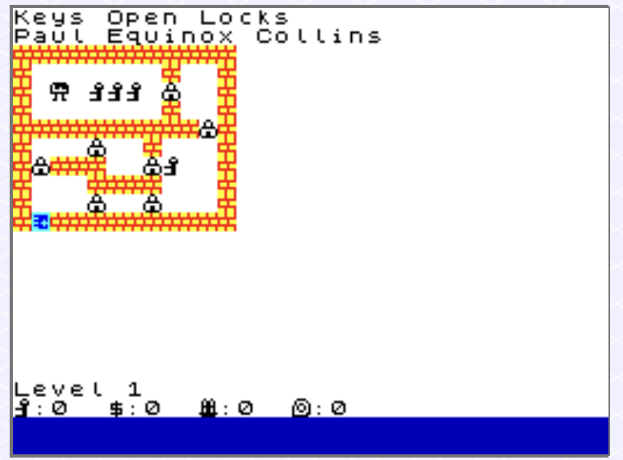

# Mushroom Man

Old PC, but also ZX Spectrum Game

[Entry in World of Spectrum](https://worldofspectrum.net/item/0023117/)

## Splashscreen

## Screenshot Level 1

## Level Symbols Analysis

Different levels can have different grid sizes.
The currently biggest one is 20 tiles wide and 14 tiles high.

The game uses various symbols in its level files (`MushroomMan/levels.dat` and `MushroomMan/levels.txt`) to represent different gameplay elements:

### Basic Elements
- `w` = Wall
- `s` = Start position
- `e` = Exit
- `l` = Lock
- `k` = Key
- `h` = Hole
- `c` = Cement

### Interactive Objects
- `j` = Jellybean (can be pushed)
- `b` = Bomb (destroys walls)
- `d` = Dynamite (destroys impenetrable walls)
- `g` = Guard
- `f` = Money/Finance (to bribe guards)
- `o` = Oxygen tank
- `n` = Gun/weapon that fires bullets

### Terrain & Environment
- `~` = Water
- `i` = Impenetrable wall (cannot be destroyed by bombs)
- ` ` = Empty walkable space

### Teleports
- `t##` = Teleport pairs (where ## is a two-digit number)
  - Examples: `t11`, `t12`, `t21`, `t22`, etc.
  - Teleports with the same number are connected to each other

### Gameplay Mechanics
The player moves around step by step, either horizontally
or vertically. The goal is to move from Start to End.
Fewer steps is better.

Based on level titles and element interactions:

#### Keys and Locks
- Keys can be collected by walking over them
- Locks block passage and require one key to unlock
- Walking into a lock consumes one key and removes the lock
- Without keys, locks cannot be passed

#### Holes and Cement
- Cement sacks can be collected by walking over them
- Holes are dangerous obstacles that must be filled with cement
- Walking into a hole **without cement** causes the player to fall in and die, failing the level
- Walking into a hole **with cement** consumes one cement and fills the hole, making it traversable
- Filled holes become plain walkable space

#### Guards and Money
- Money can be collected by walking over it
- Guards block passage and must be bribed with money
- Walking into a guard **without money** is blocked (cannot pass)
- Walking into a guard **with money** consumes one money and bribes the guard, removing them

#### Jellybeans
- Jellybeans are pushable objects that block passage
- Walking into a jellybean will push it one tile in the direction you're moving **if** there's empty space behind it
- If successfully pushed, the jellybean moves one tile and the player moves into the jellybean's previous position
- If there's no empty space behind the jellybean (wall, another object, hole, etc.), the jellybean cannot be pushed and movement is blocked
- Jellybeans can be used to solve puzzles by pushing them into strategic positions

#### Bombs and Dynamite
- Walking into a bomb triggers an explosion in a 3x3 area centered on the bomb
- **Bombs destroy**: Regular walls, locks, keys, guards, money, cement, oxygen, holes, jellybeans, other bombs, and **even the exit**
- **Bombs do NOT destroy**: The player (you survive the explosion) and impenetrable walls
- **DYNAMITE RULES**: Dynamite is extremely dangerous and must be preserved!
  - **Dynamite blocks movement** - you cannot walk into it (like a wall)
  - Shooting dynamite with a gun = Level failure
  - Destroying dynamite with a bomb explosion = Level failure
  - **Any destruction of dynamite causes immediate level failure**
  - Dynamite must remain intact to complete the level
- **No chain reactions**: Bombs and dynamite within the blast radius are destroyed but do not explode themselves
- **Warning**: If the exit is destroyed by a bomb explosion, the level becomes impossible to complete and you must restart

#### Exit
- The exit door is the goal of each level
- Walking into the exit completes the level
- The exit can be destroyed by bombs or dynamite explosions
- If the exit is destroyed, you cannot complete the level and must restart

#### Guns
- Walking into a gun fires a bullet in the direction you were moving
- The bullet travels until it hits something
- **Impenetrable walls** stop the bullet but are NOT destroyed
- **Bombs** are destroyed by the bullet (they disappear without exploding)
- **Dynamite** - shooting it causes level failure!
- **Everything else** (regular walls, exits, guards, keys, locks, holes, jellybeans, other guns, cement, money, oxygen, water) is destroyed by the first hit
- The gun itself is consumed (removed) after firing once
- If the bullet destroys the exit, the level becomes impossible to complete

#### Water and Oxygen
- Oxygen tanks can be collected by walking over them
- **Each oxygen tank gives you 3 oxygen units**
- Water tiles are dangerous obstacles that require oxygen to traverse
- Walking into water **without oxygen** causes the player to drown and die, failing the level
- Walking into water **with oxygen** consumes one oxygen unit and you swim through (water tile remains)
- Each oxygen tank allows you to swim through **3 water tiles**
- You can cross the same water tile multiple times, consuming oxygen each time
- Plan your route carefully to ensure you have enough oxygen for all water crossings

#### Other Mechanics
- Teleports transport you between numbered pairs

The game features over 100 levels with increasing complexity, combining puzzle-solving elements with strategic gameplay mechanics. 